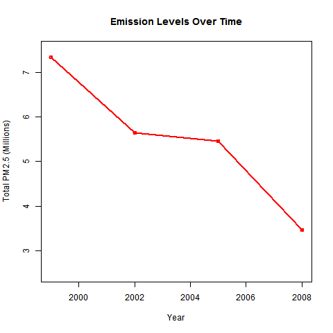
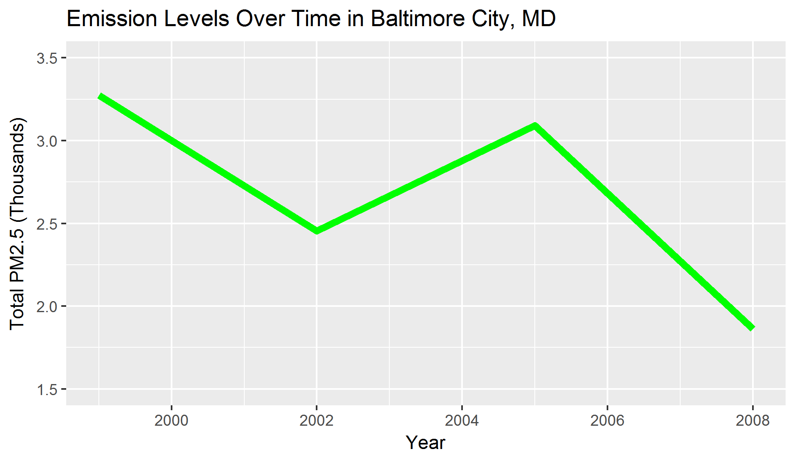
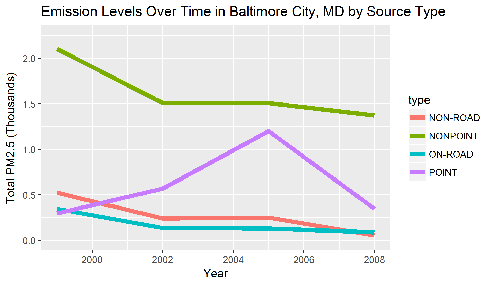
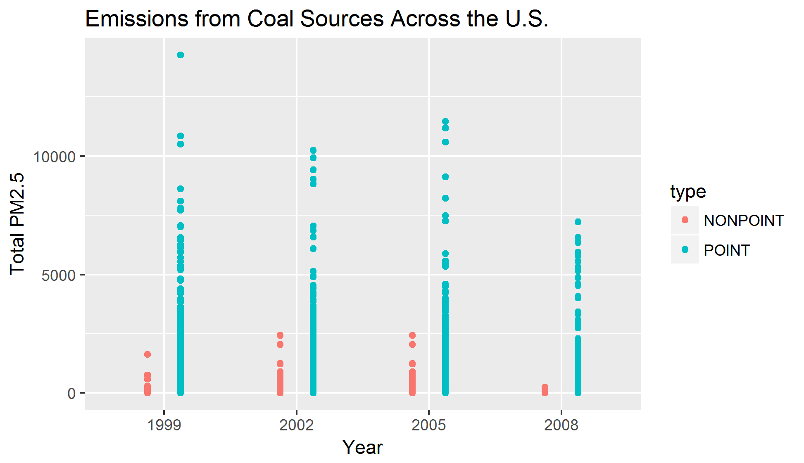
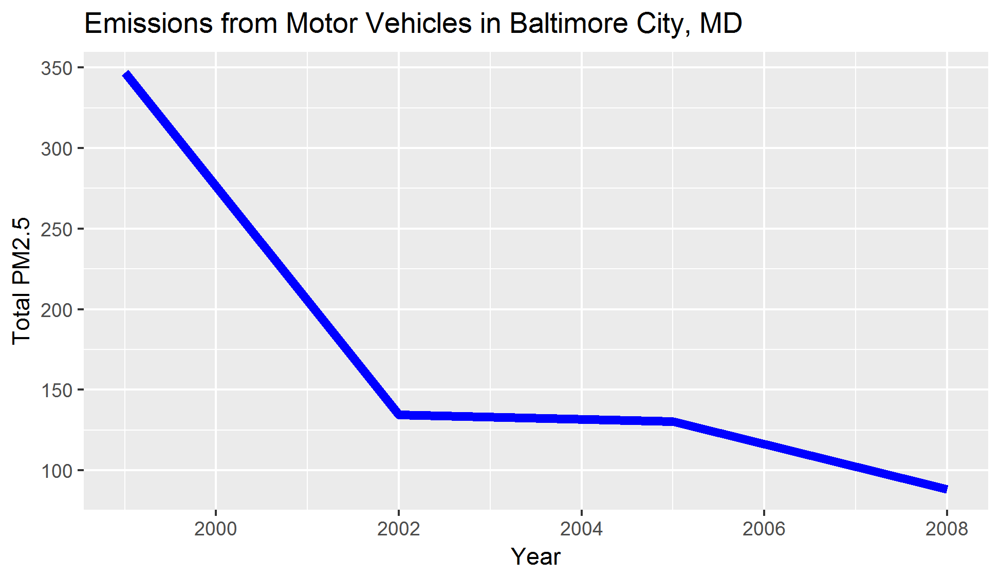
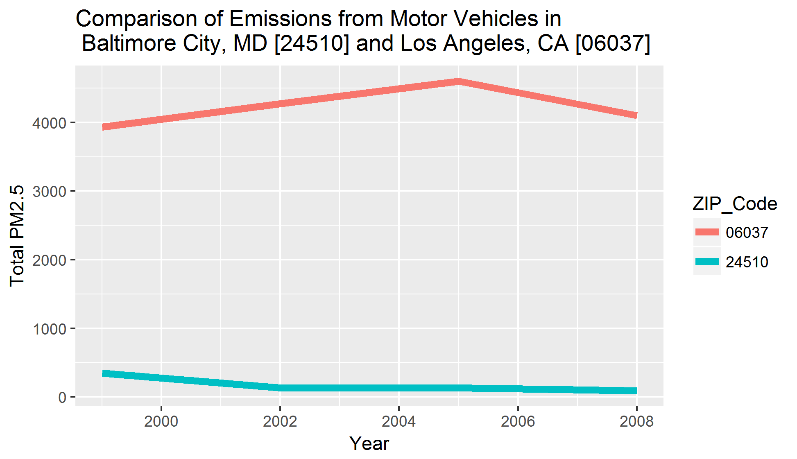

# Exploratory Analysis Project 2

##Assignment
The overall goal of this assignment is to explore the National Emissions Inventory database and see what it say about fine particulate matter pollution in the United states over the 10-year period 1999–2008.

##R Project
The R files in this repository will download the source, extract the source data files, setup all objects and generate the plot image files automatically.
Simply make sure that the R files are in the same directory and run "make.R".  Sit back and wait for your PNG files!

##Questions

1.Have total emissions from PM2.5 decreased in the United States from 1999 to 2008? Using the base plotting system, make a plot showing the total PM2.5 emission from all sources for each of the years 1999, 2002, 2005, and 2008.

2.Have total emissions from PM2.5 decreased in the Baltimore City, Maryland (fips == "24510") from 1999 to 2008? Use the base plotting system to make a plot answering this question.

3.Of the four types of sources indicated by the type (point, nonpoint, onroad, nonroad) variable, which of these four sources have seen decreases in emissions from 1999–2008 for Baltimore City? Which have seen increases in emissions from 1999–2008? Use the ggplot2 plotting system to make a plot answer this question.

4.Across the United States, how have emissions from coal combustion-related sources changed from 1999–2008?

5.How have emissions from motor vehicle sources changed from 1999–2008 in Baltimore City?

6.Compare emissions from motor vehicle sources in Baltimore City with emissions from motor vehicle sources in Los Angeles County, California (fips == "06037"). Which city has seen greater changes over time in motor vehicle emissions?

